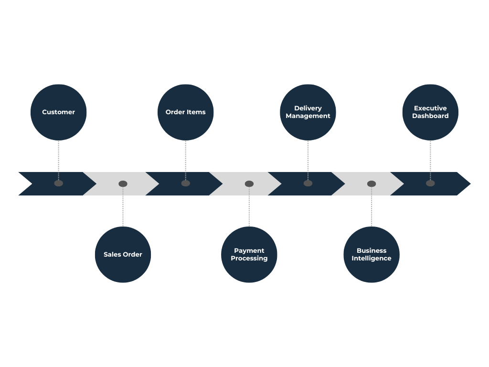
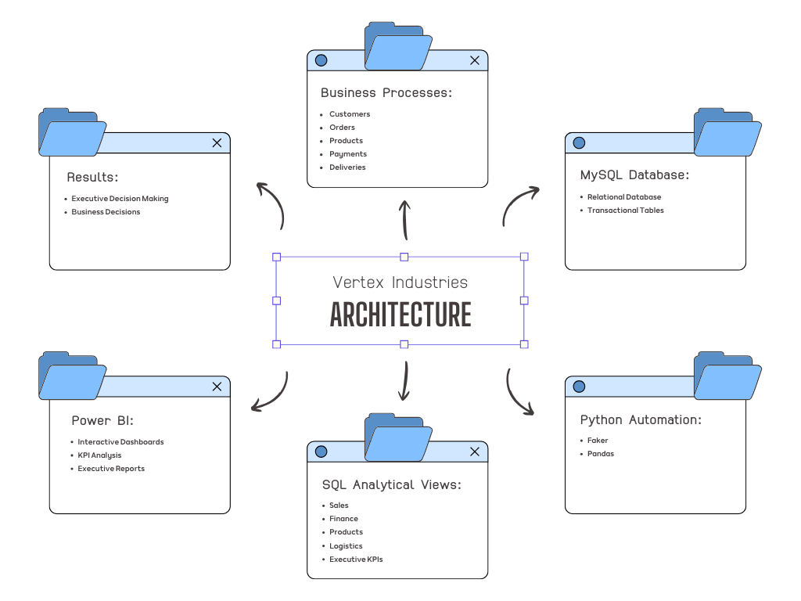

# 🚀 Vertex Industries – SAP Analytics Project

### End-to-End Data Analytics Project using SQL, Python, MySQL and Power BI

> Enterprise Business Intelligence Project inspired by SAP ERP environments.

          

## 📑 Table of Contents

- About
- Business Scenario
- Architecture
- Technologies
- Database Model
- Python Automation
- SQL Analytics
- Power BI Dashboard
- Business KPIs
- Project Structure
- Installation
- Future Improvements

## 📖 About the Project

Vertex Industries is a fictional technology company created to simulate a real-world SAP ERP environment.

The objective of this project is to demonstrate the complete lifecycle of a Business Intelligence solution, including database design, data generation, SQL analytics, and executive dashboard development.

Unlike projects focused only on dashboard creation, this solution reproduces an enterprise workflow similar to those used by organizations that rely on ERP systems such as SAP.

## 🏢 Business Scenario

Vertex Industries is a fictional Brazilian technology company specializing in enterprise infrastructure, industrial automation, logistics solutions, and networking equipment.

As the company expanded its operations across multiple states, the volume of transactional data increased significantly. Information related to customers, sales orders, products, inventory, payments, and deliveries became distributed across different business processes, making it difficult for managers to obtain a consolidated view of the company's performance.

To address this challenge, an end-to-end Business Intelligence solution was developed, inspired by SAP ERP environments. The solution integrates transactional data into an analytical model, enabling the creation of executive dashboards that support strategic decision-making.

The project simulates the complete business workflow, from customer registration and sales order generation to payment processing, logistics management, and executive reporting.

This approach demonstrates how data can be transformed into actionable business insights through SQL, Python automation, MySQL, and Power BI.

## 🏗️ Solution Architecture

The solution was designed following a layered architecture commonly found in enterprise Business Intelligence projects.

The workflow starts with transactional data stored in a relational database. Python scripts automatically generate realistic business data, which is then processed through SQL analytical views. Finally, Power BI consumes these views to build executive dashboards that support business decision-making.

### Architecture Overview

### Architecture Description

The project follows a layered Business Intelligence architecture inspired by SAP ERP environments.

The relational database stores transactional information such as customers, orders, products, payments and deliveries.

Python scripts automate the generation of realistic business records, simulating daily ERP operations.

SQL analytical views transform transactional data into optimized datasets for reporting.

Power BI connects directly to these analytical views, enabling interactive dashboards focused on executive decision-making.

## 🛠️ Technology Stack

The project combines database modeling, data engineering, automation, analytics, and business intelligence technologies to simulate an enterprise SAP-inspired environment.

| Technology | Purpose | Role in the Project |
|------------|---------|---------------------|
| **Python** | Data Generation & Automation | Generates realistic customers, orders, payments, deliveries and other transactional records. |
| **Pandas** | Data Manipulation | Supports data processing and preparation during the automation phase. |
| **Faker** | Synthetic Data Generation | Creates realistic business information for customers and transactions. |
| **MySQL** | Relational Database | Stores all transactional ERP data. |
| **SQL** | Data Query & Analytics | Responsible for analytical queries, KPIs and SQL Views. |
| **Power BI** | Business Intelligence | Builds interactive dashboards and executive reports. |
| **Git** | Version Control | Tracks project evolution and source code changes. |
| **GitHub** | Project Repository | Hosts documentation, source code and project artifacts. |

## 💡 Why These Technologies?

The selected technologies were chosen to reproduce a complete Business Intelligence pipeline commonly found in enterprise environments.

Python automates transactional data generation.

MySQL provides a structured relational database similar to ERP systems.

SQL transforms transactional records into analytical datasets.

Power BI delivers interactive dashboards for strategic decision-making.

Git and GitHub ensure version control and professional project documentation.

## 🎯 Skills Demonstrated

- Relational Database Modeling

- SQL Development

- Data Engineering Fundamentals

- Python Automation

- Business Intelligence

- Dashboard Design

- KPI Development

- Data Visualization

- ERP Business Processes

- Business Analytics

